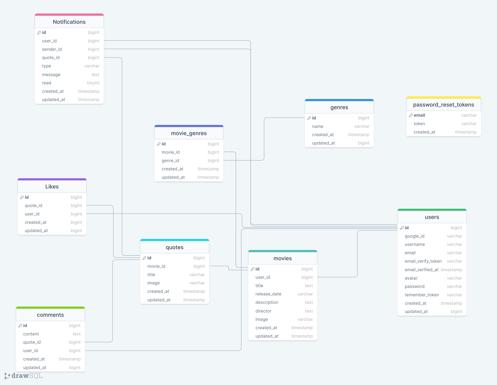

## Api epic movie quotes
#### Author: Saba Dumbadze

#

## Table of Contents

* [Prerequisites](#prerequisites)
* [Getting Started](#getting-started)
* [Configuration](#configuration)
* [Development](#development)
* [Database Structure](#database-structure)

#

## Prerequisites

* _PHP@8.2 and up_
* _composer@2.4 and up_
* _npm@6.14 and up_
* _MYSQL@8 and up_

#

## Tech Stack

-   [Laravel](https://laravel.com/)
-   [Spatie Translatable](https://github.com/spatie/laravel-translatable)
-   [Pusher](https://pusher.com/tutorials/how-to-build-a-chat-app-with-vue-js-and-laravel/)

#

## Getting Started

1.  Clone the repository from GitHub:
    ```shell
      git clone https://github.com/RedberryInternship/saba-dumbadze-epic-movie-quotes-api.git
      cd saba-dumbadze-epic-movie-quotes-api
    ```
2.  Install PHP dependencies:
    ```shell
      composer install
    ```

3.  Copy the `.env` file:
    ```shell
      cp .env.example .env
    ```

#

## Configuration

1. Modify the database configuration in your `.env` file. DB_PASSWORD is empty by default.
   > DB_CONNECTION=mysql <br>
   DB_HOST=127.0.0.1 <br>
   DB_PORT=3306 <br>
   DB_DATABASE=movie_quotes <br>
   DB_USERNAME=<your_username> <br>
   DB_PASSWORD=<your_password> <br>

2. Modify the pusher and google cloudd configuration in your `.env` file.

3. Run database migrations:
```shell
    php artisan migrate
```

4. Fetch genres:

```shell
    php artisan fetch:genres
```

#

## Development

You need to start Laravel server:

```shell
    php artisan serve
```


## Database Design Diagram

https://drawsql.app/teams/sabas-team/diagrams/coronatime



#
